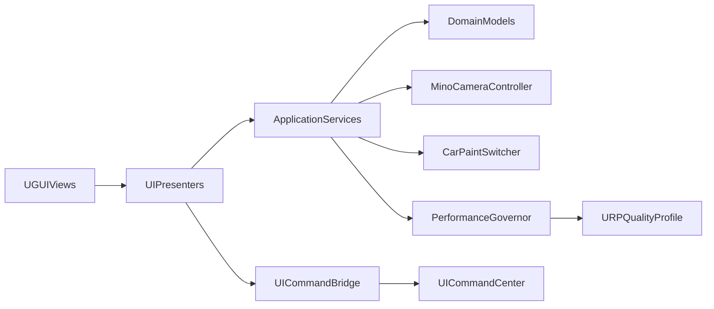

# Unity URP 3D HMI UI 框架设计（UGUI + 8295 芯片）

## 目标与约束
- 目标：构建可量产化的 3D 桌面车模 HMI UI 框架，保证模块解耦、可扩展、易迭代。
- 技术选择：`UGUI` 为主（与现有命令绑定体系兼容性最好）。
- 硬件定位：`8295` 车机芯片，优先稳定 60 FPS（复杂场景可按策略降级）。

## 复用现有能力（避免推倒重来）
- 命令路由基础：`Assets/Plugins/MinoTools/MinoUICommandSystem/UICommandCenter.cs`
- UI 按钮绑定：`Assets/Plugins/MinoTools/MinoUICommandSystem/UIButtonCommandBinder.cs`
- 3D 相机交互：`Assets/Plugins/MinoTools/MinoCameraController/MinoCameraController.cs`
- 车漆切换业务：`Assets/_MinoHMI/Scripts/CarPaint/CarPaintSwitcher.cs`
- URP 配置资产：`Assets/Settings/URP-HMI.asset`、`Assets/Settings/URP-HMI-Renderer.asset`

## 框架分层（推荐）
- `Presentation`：页面与控件表现层（Panel/Page/Widget，动画、显隐、状态展示）。
- `Interaction`：输入与交互编排层（点击、拖拽、旋钮、手势、长按节流）。
- `Application`：用例与流程层（相机机位切换、车漆切换、场景状态机）。
- `Domain`：业务模型层（车漆预设、机位配置、功能状态、权限状态）。
- `Infrastructure`：资源、配置、事件总线、日志、性能采样、设备适配。

## 核心子系统设计
- 页面管理：`UIRoot -> LayerStack -> PageController`，拆分 `BaseLayer/PopupLayer/SystemLayer`。
- 导航系统：以 `PageId` 驱动，支持 `Push/Replace/Back`，统一转场动画。
- 命令总线：保留 `UICommandCenter`，新增 `UICommandBridge` 将字符串命令映射到强类型用例。
- 状态同步：引入轻量状态容器（`ScriptableObject + C# Event`），避免 UI 直接拉取业务对象。
- 3D 交互仲裁：新增 `InteractionArbiter`，统一判定输入归属（UI 或车模相机）。
- 主题与皮肤：集中管理颜色、字体、尺寸、动效参数，支持昼夜主题切换。

## URP 与 8295 性能策略（默认基线）
- Canvas 策略：减少动态重建，按“静态背景 / 高频刷新 / 弹窗”拆分多个 Canvas。
- 渲染策略：UI 纹理图集化、尽量共材质；避免过度 Mask 和半透明重叠。
- 后处理策略：默认轻量（Bloom 低强度可选），避免高开销 SSR/复杂 AO 组合。
- 相机策略：车模相机与 UI 相机职责清晰，减少不必要的后处理叠加。
- 降级策略：提供 `High/Medium/Low` 三档 URP 配置，按实时帧率自动降级关键参数。

## 目录与命名规范（建议）
- `Assets/_MinoHMI/Scripts/UI/Core`：页面栈、导航、生命周期。
- `Assets/_MinoHMI/Scripts/UI/Interaction`：输入仲裁、手势识别。
- `Assets/_MinoHMI/Scripts/UI/Application`：相机/车漆/功能编排。
- `Assets/_MinoHMI/Scripts/UI/Theme`：主题和样式配置。
- `Assets/_MinoHMI/Scripts/UI/Performance`：性能治理与自动降级。
- 命名约定：`名词 + 职责后缀`，例如 `PaintPagePresenter`、`CameraPresetUseCase`、`UiFrameBudgetWatcher`。

## 分阶段落地
- 第 1 阶段：搭建骨架（`UIRoot`、`PageController`、`UICommandBridge`、`InteractionArbiter`），打通“按钮 -> 命令 -> 车模动作”。
- 第 2 阶段：迁移现有能力（车漆切换、机位切换）至 Application 层，减少场景硬绑定。
- 第 3 阶段：建立主题系统与资源规范，统一样式、动画、字号缩放。
- 第 4 阶段：接入性能治理（帧率采样、URP 档位切换、UI 复杂度告警）。
- 第 5 阶段：沉淀组件库（按钮、开关、滑块、卡片、弹窗）与模板页面。

## 验收标准
- 功能：车漆切换、机位切换、页面导航可通过统一命令链路触发。
- 架构：UI 层不直接依赖具体 3D 对象引用（通过 UseCase/Bridge 间接调用）。
- 性能：8295 目标场景稳定运行，具备可观测与自动降级能力。
- 工程：新增页面可按模板低耦合接入，避免复制粘贴式开发。
